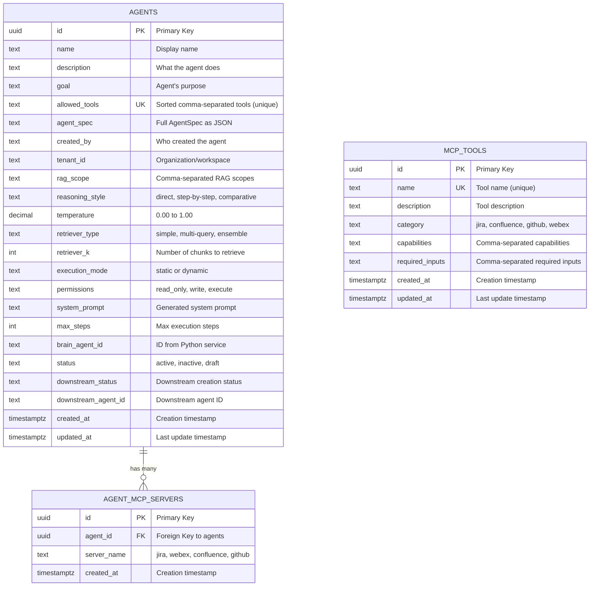
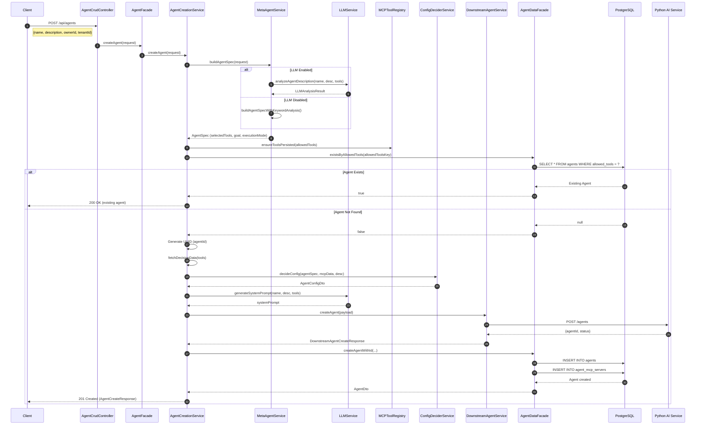
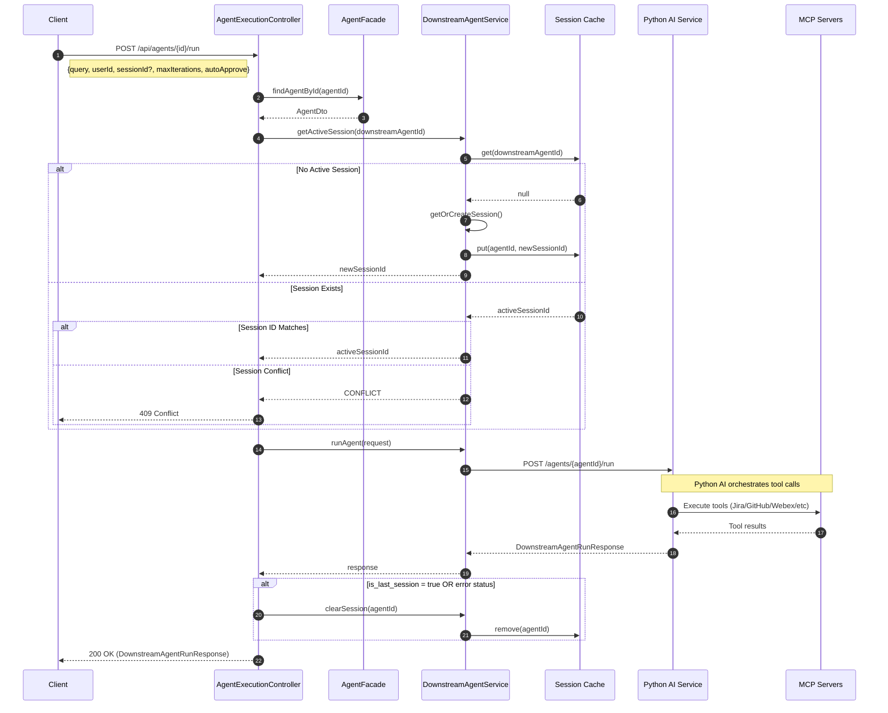
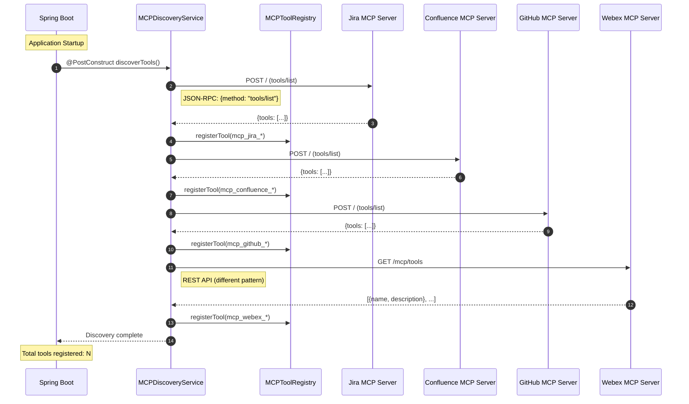
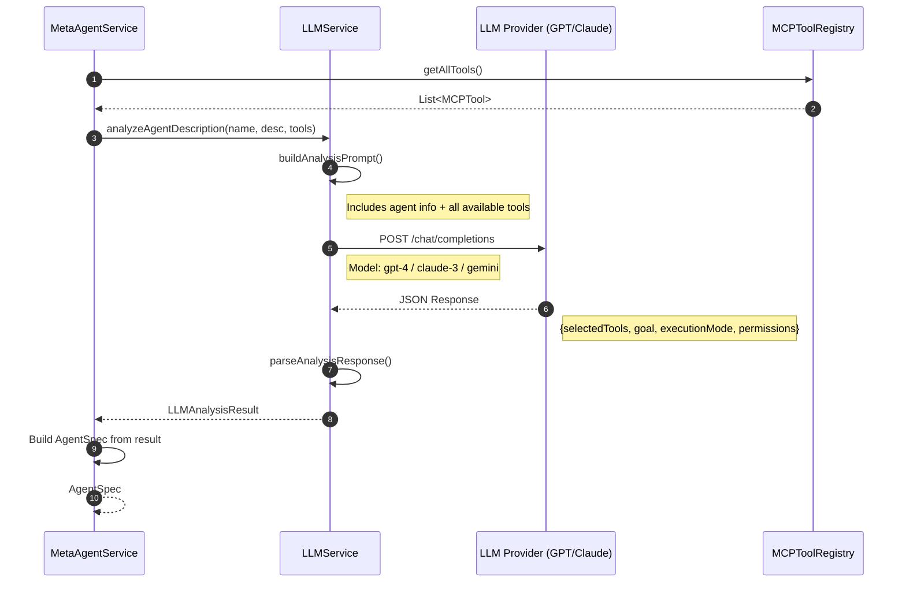

# Agent Framework

A Spring Boot microservice for creating, managing, and executing AI agents with dynamic MCP (Model Context Protocol) tool integration.

## Table of Contents

- [Overview](#overview)
- [Architecture](#architecture)
- [High Level Design (HLD)](#high-level-design-hld)
- [Low Level Design (LLD)](#low-level-design-lld)
- [Entity Relationship Diagram](#entity-relationship-diagram)
- [Sequence Diagrams](#sequence-diagrams)
- [MCP Tool Selection Strategies](#mcp-tool-selection-strategies)
- [Module Structure](#module-structure)
- [API Reference](#api-reference)
- [Configuration](#configuration)
- [Quick Start](#quick-start)

---

## Overview

The Agent Framework is a Java-based orchestration layer that:

- **Creates AI agents** dynamically based on natural language descriptions
- **Discovers and integrates** with MCP servers (Jira, Confluence, GitHub, Webex)
- **Manages agent lifecycle** with persistent storage in PostgreSQL
- **Orchestrates execution** by routing queries to downstream AI services
- **Uses LLM intelligence** for tool selection and argument building

---

## Architecture

### High Level Design (HLD)

```
┌─────────────────────────────────────────────────────────────────────────────┐
│                              CLIENT LAYER                                    │
│                    (REST API Clients / Web UI / CLI)                        │
└─────────────────────────────────────────────────────────────────────────────┘
                                      │
                                      ▼
┌─────────────────────────────────────────────────────────────────────────────┐
│                           API GATEWAY LAYER                                  │
│  ┌─────────────────┐  ┌─────────────────┐  ┌─────────────────────────────┐  │
│  │ AgentCrudCtrl   │  │ AgentExecCtrl   │  │ ToolController              │  │
│  │ POST /agents    │  │ POST /run       │  │ GET /tools                  │  │
│  │ GET /agents     │  │ DELETE /session │  │ GET /tools/categories       │  │
│  │ DELETE /agents  │  │                 │  │                             │  │
│  └─────────────────┘  └─────────────────┘  └─────────────────────────────┘  │
└─────────────────────────────────────────────────────────────────────────────┘
                                      │
                                      ▼
┌─────────────────────────────────────────────────────────────────────────────┐
│                           FACADE LAYER                                       │
│  ┌─────────────────────────────────────────────────────────────────────┐    │
│  │                         AgentFacade                                  │    │
│  │  • Orchestrates agent creation workflow                             │    │
│  │  • Coordinates between services and data layer                      │    │
│  │  • Handles deduplication logic                                      │    │
│  └─────────────────────────────────────────────────────────────────────┘    │
└─────────────────────────────────────────────────────────────────────────────┘
                                      │
                                      ▼
┌─────────────────────────────────────────────────────────────────────────────┐
│                          SERVICE LAYER                                       │
│  ┌────────────────┐  ┌────────────────┐  ┌────────────────┐                 │
│  │ MetaAgentSvc   │  │ AgentCreation  │  │ AgentExecutor  │                 │
│  │ • Analyzes     │  │ • Builds spec  │  │ • Calls MCP    │                 │
│  │   descriptions │  │ • Persists     │  │ • Routes to    │                 │
│  │ • Selects tools│  │ • Creates      │  │   downstream   │                 │
│  └────────────────┘  └────────────────┘  └────────────────┘                 │
│                                                                              │
│  ┌────────────────┐  ┌────────────────┐  ┌────────────────┐                 │
│  │ LLMService     │  │ ConfigDecider  │  │ DownstreamSvc  │                 │
│  │ • GPT/Claude   │  │ • RAG config   │  │ • Python agent │                 │
│  │ • Tool select  │  │ • Reasoning    │  │ • Session mgmt │                 │
│  │ • Arg building │  │ • Temperature  │  │ • Run requests │                 │
│  └────────────────┘  └────────────────┘  └────────────────┘                 │
│                                                                              │
│  ┌────────────────┐  ┌────────────────┐                                     │
│  │ MCPDiscovery   │  │ MCPDataFetcher │                                     │
│  │ • Discovers    │  │ • Fetches data │                                     │
│  │   tools at     │  │   for config   │                                     │
│  │   startup      │  │   decisions    │                                     │
│  └────────────────┘  └────────────────┘                                     │
└─────────────────────────────────────────────────────────────────────────────┘
                                      │
                                      ▼
┌─────────────────────────────────────────────────────────────────────────────┐
│                           DATA LAYER                                         │
│  ┌─────────────────────────────────────────────────────────────────────┐    │
│  │                      AgentDataFacade                                 │    │
│  │  ┌─────────────────┐  ┌─────────────────┐  ┌───────────────────┐   │    │
│  │  │ AgentRepository │  │ McpToolRepository│  │ MCPToolRegistry   │   │    │
│  │  │ (JPA/Postgres)  │  │ (JPA/Postgres)   │  │ (In-Memory Cache) │   │    │
│  │  └─────────────────┘  └─────────────────┘  └───────────────────┘   │    │
│  └─────────────────────────────────────────────────────────────────────┘    │
└─────────────────────────────────────────────────────────────────────────────┘
                                      │
                                      ▼
┌─────────────────────────────────────────────────────────────────────────────┐
│                        EXTERNAL SYSTEMS                                      │
│  ┌─────────────┐  ┌─────────────┐  ┌─────────────┐  ┌─────────────┐        │
│  │  PostgreSQL │  │ MCP Servers │  │  Downstream │  │ LLM Provider│        │
│  │  Database   │  │ Jira/GitHub │  │  Python AI  │  │ GPT/Claude  │        │
│  │             │  │ Confluence  │  │  Service    │  │ Gemini      │        │
│  │             │  │ Webex       │  │             │  │             │        │
│  └─────────────┘  └─────────────┘  └─────────────┘  └─────────────┘        │
└─────────────────────────────────────────────────────────────────────────────┘
```

### Component Descriptions

| Layer | Component | Responsibility |
|-------|-----------|----------------|
| **API** | AgentCrudController | CRUD operations for agents |
| **API** | AgentExecutionController | Run agents, manage sessions |
| **API** | ToolController | List available MCP tools |
| **Facade** | AgentFacade | Orchestrate agent workflows |
| **Service** | MetaAgentService | Analyze descriptions, select tools |
| **Service** | AgentCreationService | Create agents with full config |
| **Service** | AgentExecutorService | Execute MCP tool calls |
| **Service** | LLMService | LLM integration for intelligence |
| **Service** | DownstreamAgentService | Communicate with Python AI |
| **Service** | MCPDiscoveryService | Discover tools from MCP servers |
| **Data** | AgentDataFacade | Abstract data operations |
| **Data** | MCPToolRegistry | In-memory tool cache |

---

### Low Level Design (LLD)

```
┌─────────────────────────────────────────────────────────────────────────────┐
│                         CONTROLLER CLASSES                                   │
├─────────────────────────────────────────────────────────────────────────────┤
│                                                                              │
│  ┌──────────────────────────────────────────────────────────────────────┐   │
│  │  AgentCrudController                                                  │   │
│  │  @RestController @RequestMapping("/api/agents")                       │   │
│  │  ├── POST /           → createAgent(CreateAgentRequest)              │   │
│  │  ├── GET /            → listAgents(ownerId, tenantId, status, ...)   │   │
│  │  ├── GET /{id}        → getAgent(UUID)                               │   │
│  │  ├── GET /{id}/config → getAgentConfig(UUID)                         │   │
│  │  └── DELETE /{id}     → deleteAgent(UUID)                            │   │
│  └──────────────────────────────────────────────────────────────────────┘   │
│                                                                              │
│  ┌──────────────────────────────────────────────────────────────────────┐   │
│  │  AgentExecutionController                                             │   │
│  │  @RestController @RequestMapping("/api/agents")                       │   │
│  │  ├── POST /{id}/run     → runAgentById(UUID, RunAgentRequest)        │   │
│  │  └── DELETE /{id}/session → clearSession(UUID)                       │   │
│  └──────────────────────────────────────────────────────────────────────┘   │
│                                                                              │
│  ┌──────────────────────────────────────────────────────────────────────┐   │
│  │  ToolController                                                       │   │
│  │  @RestController @RequestMapping("/api/tools")                        │   │
│  │  ├── GET /            → getTools()                                   │   │
│  │  └── GET /categories  → getToolCategories()                          │   │
│  └──────────────────────────────────────────────────────────────────────┘   │
│                                                                              │
└─────────────────────────────────────────────────────────────────────────────┘

┌─────────────────────────────────────────────────────────────────────────────┐
│                           SERVICE CLASSES                                    │
├─────────────────────────────────────────────────────────────────────────────┤
│                                                                              │
│  ┌──────────────────────────────────────────────────────────────────────┐   │
│  │  AgentCreationService                                                 │   │
│  │  ├── createAgent(CreateAgentRequest) → AgentCreationOutcome          │   │
│  │  │   ├── buildAgentSpec()                                            │   │
│  │  │   ├── normalizeTools()                                            │   │
│  │  │   ├── handleExistingAgent() [deduplication]                       │   │
│  │  │   ├── fetchDecisionData()                                         │   │
│  │  │   ├── decideConfig()                                              │   │
│  │  │   ├── createDownstreamAgent() → Python service                    │   │
│  │  │   └── persistNewAgent()                                           │   │
│  │  └── Dependencies: MetaAgentService, MCPToolRegistry, LLMService,    │   │
│  │                    ConfigDeciderService, DownstreamAgentService       │   │
│  └──────────────────────────────────────────────────────────────────────┘   │
│                                                                              │
│  ┌──────────────────────────────────────────────────────────────────────┐   │
│  │  MetaAgentService                                                     │   │
│  │  ├── buildAgentSpec(CreateAgentRequest) → AgentSpec                  │   │
│  │  │   ├── buildAgentSpecWithLLM() [if LLM enabled]                    │   │
│  │  │   └── buildAgentSpecWithKeywordAnalysis() [fallback]              │   │
│  │  ├── extractKeywords(text) → List<String>                            │   │
│  │  ├── findMatchingTools(keywords, availableTools) → List<String>      │   │
│  │  ├── determineExecutionMode(description) → String                    │   │
│  │  └── determinePermissions(description) → List<String>                │   │
│  └──────────────────────────────────────────────────────────────────────┘   │
│                                                                              │
│  ┌──────────────────────────────────────────────────────────────────────┐   │
│  │  AgentExecutorService                                                 │   │
│  │  ├── executeAgent(AgentExecutionRequest) → AgentExecutionResponse    │   │
│  │  ├── callMcpTool(MCPTool, arguments) → Object                        │   │
│  │  │   ├── JSON-RPC for Jira/Confluence/GitHub                         │   │
│  │  │   └── REST for Webex                                              │   │
│  │  ├── buildToolArguments(tool, request) → Map<String, Object>         │   │
│  │  └── WebClients: jiraMcpClient, confluenceMcpClient, githubMcpClient │   │
│  └──────────────────────────────────────────────────────────────────────┘   │
│                                                                              │
│  ┌──────────────────────────────────────────────────────────────────────┐   │
│  │  LLMService                                                           │   │
│  │  ├── isEnabled() → boolean                                           │   │
│  │  ├── analyzeAgentDescription(name, desc, tools) → LLMAnalysisResult  │   │
│  │  ├── buildToolArguments(toolName, query, desc) → Map<String, Object> │   │
│  │  ├── generateSystemPrompt(name, desc, tools) → String                │   │
│  │  └── Providers: Cisco LLM Proxy, OpenAI, Anthropic, Gemini           │   │
│  └──────────────────────────────────────────────────────────────────────┘   │
│                                                                              │
│  ┌──────────────────────────────────────────────────────────────────────┐   │
│  │  DownstreamAgentService                                               │   │
│  │  ├── createAgent(DownstreamAgentCreateRequest) → Response            │   │
│  │  ├── getAgent(agentId) → DownstreamAgentDetailResponse               │   │
│  │  ├── listAgents(filters) → DownstreamAgentListResponse               │   │
│  │  ├── runAgent(DownstreamAgentRunRequest) → DownstreamAgentRunResponse│   │
│  │  └── Session Management:                                              │   │
│  │      ├── getOrCreateSession(agentId)                                 │   │
│  │      ├── getActiveSession(agentId)                                   │   │
│  │      ├── isValidSession(agentId, sessionId)                          │   │
│  │      └── clearSession(agentId)                                       │   │
│  └──────────────────────────────────────────────────────────────────────┘   │
│                                                                              │
│  ┌──────────────────────────────────────────────────────────────────────┐   │
│  │  MCPDiscoveryService                                                  │   │
│  │  ├── @PostConstruct discoverTools()                                  │   │
│  │  │   ├── discoverFromServer(category, url, token, isRestApi)         │   │
│  │  │   ├── discoverFromJsonRpc() [Jira/Confluence/GitHub]              │   │
│  │  │   └── discoverFromRestApi() [Webex]                               │   │
│  │  ├── parseAndRegisterTools(category, response)                       │   │
│  │  └── refresh() → Re-discover all tools                               │   │
│  └──────────────────────────────────────────────────────────────────────┘   │
│                                                                              │
└─────────────────────────────────────────────────────────────────────────────┘

┌─────────────────────────────────────────────────────────────────────────────┐
│                            DATA CLASSES                                      │
├─────────────────────────────────────────────────────────────────────────────┤
│                                                                              │
│  ┌──────────────────────────────────────────────────────────────────────┐   │
│  │  Entity: Agent                                                        │   │
│  │  @Table(name = "agents")                                              │   │
│  │  ├── id: UUID (PK)                                                   │   │
│  │  ├── name, description, goal: String                                 │   │
│  │  ├── allowedTools: String (unique, sorted comma-separated)           │   │
│  │  ├── agentSpec: TEXT (JSON)                                          │   │
│  │  ├── Configuration: ragScope, reasoningStyle, temperature,           │   │
│  │  │                  retrieverType, retrieverK, executionMode         │   │
│  │  ├── Downstream: downstreamStatus, downstreamAgentId                 │   │
│  │  ├── mcpServers: List<AgentMcpServer> (OneToMany)                    │   │
│  │  └── Timestamps: createdAt, updatedAt                                │   │
│  └──────────────────────────────────────────────────────────────────────┘   │
│                                                                              │
│  ┌──────────────────────────────────────────────────────────────────────┐   │
│  │  Entity: AgentMcpServer                                               │   │
│  │  @Table(name = "agent_mcp_servers")                                   │   │
│  │  ├── id: UUID (PK)                                                   │   │
│  │  ├── agent: Agent (ManyToOne, FK → agents.id)                        │   │
│  │  ├── serverName: String                                              │   │
│  │  └── createdAt: OffsetDateTime                                       │   │
│  └──────────────────────────────────────────────────────────────────────┘   │
│                                                                              │
│  ┌──────────────────────────────────────────────────────────────────────┐   │
│  │  Entity: McpToolEntity                                                │   │
│  │  @Table(name = "mcp_tools")                                           │   │
│  │  ├── id: UUID (PK)                                                   │   │
│  │  ├── name: String (unique)                                           │   │
│  │  ├── description, category: String                                   │   │
│  │  ├── capabilities: List<String>                                      │   │
│  │  ├── requiredInputs: List<String>                                    │   │
│  │  └── Timestamps: createdAt, updatedAt                                │   │
│  └──────────────────────────────────────────────────────────────────────┘   │
│                                                                              │
│  ┌──────────────────────────────────────────────────────────────────────┐   │
│  │  MCPToolRegistry (In-Memory Cache)                                    │   │
│  │  ├── ConcurrentHashMap<String, MCPTool> tools                        │   │
│  │  ├── registerTool(MCPTool)                                           │   │
│  │  ├── getTool(name) → Optional<MCPTool>                               │   │
│  │  ├── getAllTools() → List<MCPTool>                                   │   │
│  │  ├── getToolsByCategory(category) → List<MCPTool>                    │   │
│  │  └── ensureToolsPersisted(toolNames) → Sync to DB                    │   │
│  └──────────────────────────────────────────────────────────────────────┘   │
│                                                                              │
└─────────────────────────────────────────────────────────────────────────────┘
```

---

## Entity Relationship Diagram



### Relationships

| Relationship | Type | Description |
|--------------|------|-------------|
| `AGENTS` → `AGENT_MCP_SERVERS` | One-to-Many | An agent can use multiple MCP servers |
| `MCP_TOOLS` | Standalone | Registry of all available MCP tools |

### Key Constraints

- **`agents.allowed_tools`**: UNIQUE constraint ensures one agent per tool combination (deduplication)
- **`agent_mcp_servers(agent_id, server_name)`**: UNIQUE constraint prevents duplicate server assignments
- **`mcp_tools.name`**: UNIQUE constraint prevents duplicate tool registrations

---

## Sequence Diagrams

### 1. Agent Creation Flow



### 2. Agent Execution Flow



### 3. MCP Tool Discovery Flow (Startup)



### 4. LLM-Powered Tool Selection



---

## MCP Tool Selection Strategies

The framework supports **three different strategies** for deciding which MCP tools to select when creating an agent:

| Strategy | Description | Best For |
|----------|-------------|----------|
| **1. Static Keyword Mapping** | Tokenizes query and matches against predefined keyword mappings | Fast, deterministic results |
| **2. LLM-Based Selection** | Uses AI (GPT-4/Claude) to semantically analyze and select tools | Complex, novel queries |
| **3. Cosine Similarity** | Vector embeddings with cosine similarity scoring | Large catalogs, multi-language |

```
┌──────────────────┬──────────────────┬──────────────────┬────────────────────┐
│                  │  KEYWORD MAPPING │   LLM SELECTION  │ COSINE SIMILARITY  │
├──────────────────┼──────────────────┼──────────────────┼────────────────────┤
│ Latency          │ < 10ms ⚡        │ 500ms - 2s 🐢    │ 50-200ms 🚀        │
│ Cost per Query   │ $0 💰           │ $0.01-0.10 💸    │ $0.0001 💰         │
│ Accuracy         │ 70-80%          │ 90-95%           │ 85-92%             │
│ Semantic Aware   │ ❌ No           │ ✅ Yes           │ ✅ Yes             │
└──────────────────┴──────────────────┴──────────────────┴────────────────────┘
```

**For detailed documentation with diagrams, code examples, and implementation details, see:**

**[MCP Tool Selection Strategies Documentation](docs/MCP_TOOL_SELECTION_STRATEGIES.md)**

---

## Module Structure

```
agent-framework/
├── build.gradle                    # Root build config
├── settings.gradle                 # Multi-module settings
├── docker-compose.yml              # PostgreSQL container
├── README.md                       # This file
│
├── src/main/                       # Main Application Module
│   ├── java/com/agentframework/
│   │   ├── AgentFrameworkApplication.java
│   │   │
│   │   ├── controller/             # REST API Layer
│   │   │   ├── AgentCrudController.java
│   │   │   ├── AgentExecutionController.java
│   │   │   ├── AgentLegacyController.java
│   │   │   ├── AgentUtilityController.java
│   │   │   └── ToolController.java
│   │   │
│   │   ├── dto/                    # Data Transfer Objects
│   │   │   ├── CreateAgentRequest.java
│   │   │   ├── AgentCreateResponse.java
│   │   │   ├── AgentSpec.java
│   │   │   ├── RunAgentRequest.java
│   │   │   ├── DownstreamAgent*.java
│   │   │   └── ... (30+ DTOs)
│   │   │
│   │   ├── exception/              # Exception Handling
│   │   │   └── GlobalExceptionHandler.java
│   │   │
│   │   ├── facade/                 # Orchestration Layer
│   │   │   ├── AgentFacade.java
│   │   │   └── impl/
│   │   │       └── AgentFacadeImpl.java
│   │   │
│   │   ├── registry/               # Tool Registry
│   │   │   ├── MCPTool.java
│   │   │   └── MCPToolRegistry.java
│   │   │
│   │   └── service/                # Business Logic
│   │       ├── AgentCreationService.java
│   │       ├── AgentExecutorService.java
│   │       ├── ConfigDeciderService.java
│   │       ├── DownstreamAgentService.java
│   │       ├── LLMService.java
│   │       ├── MCPDataFetcherService.java
│   │       ├── MCPDiscoveryService.java
│   │       └── MetaAgentService.java
│   │
│   └── resources/
│       ├── application.yaml        # Main configuration
│       ├── application.properties  # DB connection
│       └── schema.sql              # Database schema
│
├── agent-common/                   # Shared DTOs Module
│   └── src/main/java/.../common/dto/
│       ├── AgentConfigDto.java
│       └── AgentDto.java
│
└── agent-data/                     # Data Access Module
    └── src/main/java/.../data/
        ├── config/
        │   └── DataModuleConfig.java
        ├── entity/
        │   ├── Agent.java
        │   ├── AgentMcpServer.java
        │   ├── McpToolEntity.java
        │   └── StringArrayConverter.java
        ├── facade/
        │   ├── AgentDataFacade.java
        │   └── impl/
        │       └── AgentDataFacadeImpl.java
        └── repository/
            ├── AgentRepository.java
            └── McpToolRepository.java
```

---

## API Reference

### Agent Management

| Method | Endpoint | Description |
|--------|----------|-------------|
| `POST` | `/api/agents` | Create a new agent |
| `GET` | `/api/agents` | List all agents |
| `GET` | `/api/agents/{id}` | Get agent by ID |
| `GET` | `/api/agents/{id}/config` | Get agent configuration |
| `DELETE` | `/api/agents/{id}` | Delete an agent |

### Agent Execution

| Method | Endpoint | Description |
|--------|----------|-------------|
| `POST` | `/api/agents/{id}/run` | Run an agent with a query |
| `DELETE` | `/api/agents/{id}/session` | Clear agent session |

### Tools

| Method | Endpoint | Description |
|--------|----------|-------------|
| `GET` | `/api/tools` | List all available MCP tools |
| `GET` | `/api/tools/categories` | List tool categories |

### Example Requests

**Create Agent:**
```bash
curl -X POST http://localhost:8080/api/agents \
  -H "Content-Type: application/json" \
  -d '{
    "name": "Jira Issue Tracker",
    "description": "Search and manage Jira issues",
    "ownerId": "user-123",
    "tenantId": "tenant-456"
  }'
```

**Run Agent:**
```bash
curl -X POST http://localhost:8080/api/agents/{agentId}/run \
  -H "Content-Type: application/json" \
  -d '{
    "query": "Find all open bugs assigned to me",
    "userId": "user-123",
    "maxIterations": 5,
    "autoApprove": true
  }'
```

---

## Configuration

### Environment Variables

| Variable | Description | Default |
|----------|-------------|---------|
| `LLM_ENABLED` | Enable LLM for tool selection | `false` |
| `LLM_PROVIDER` | LLM provider (cisco, openai, anthropic, gemini) | `none` |
| `LLM_API_KEY` | API key for LLM provider | - |
| `LLM_MODEL` | Model to use | Provider default |
| `MCP_DISCOVERY_ENABLED` | Auto-discover tools at startup | `false` |
| `MCP_JIRA_URL` | Jira MCP server URL | - |
| `JIRA_PAT_TOKEN` | Jira Personal Access Token | - |
| `MCP_CONFLUENCE_URL` | Confluence MCP server URL | - |
| `CONFLUENCE_PAT_TOKEN` | Confluence PAT | - |
| `MCP_GITHUB_URL` | GitHub MCP server URL | - |
| `GITHUB_PAT_TOKEN` | GitHub PAT | - |
| `MCP_WEBEX_URL` | Webex MCP server URL | - |
| `WEBEX_TOKEN` | Webex access token | - |
| `DOWNSTREAM_AGENT_URL` | Python AI service URL | `http://localhost:8082` |

### Database Configuration

```properties
# application.properties
spring.datasource.url=jdbc:postgresql://localhost:5432/agent_framework
spring.datasource.username=agent_user
spring.datasource.password=agent_pass
```

---

## Quick Start

### Prerequisites

- Java 21+
- Gradle
- Docker (for PostgreSQL)

### 1. Start PostgreSQL

```bash
docker compose up -d
```

### 2. Configure Environment

```bash
export LLM_ENABLED=true
export LLM_PROVIDER=openai
export LLM_API_KEY=your-api-key
export DOWNSTREAM_AGENT_URL=http://localhost:8082
```

### 3. Run the Application

```bash
./gradlew bootRun
```

### 4. Verify

```bash
curl http://localhost:8080/api/tools
```

### Stop PostgreSQL

```bash
docker compose down
# To wipe data:
docker compose down -v
```

---

## Technology Stack

| Component | Technology |
|-----------|------------|
| Framework | Spring Boot 3.x |
| Language | Java 21 |
| Database | PostgreSQL 16 |
| ORM | Spring Data JPA / Hibernate |
| HTTP Client | Spring WebFlux (WebClient) |
| Build Tool | Gradle |
| Containerization | Docker |
| LLM Integration | OpenAI / Anthropic / Gemini / Cisco LLM Proxy |

---

## License

Internal use only.
